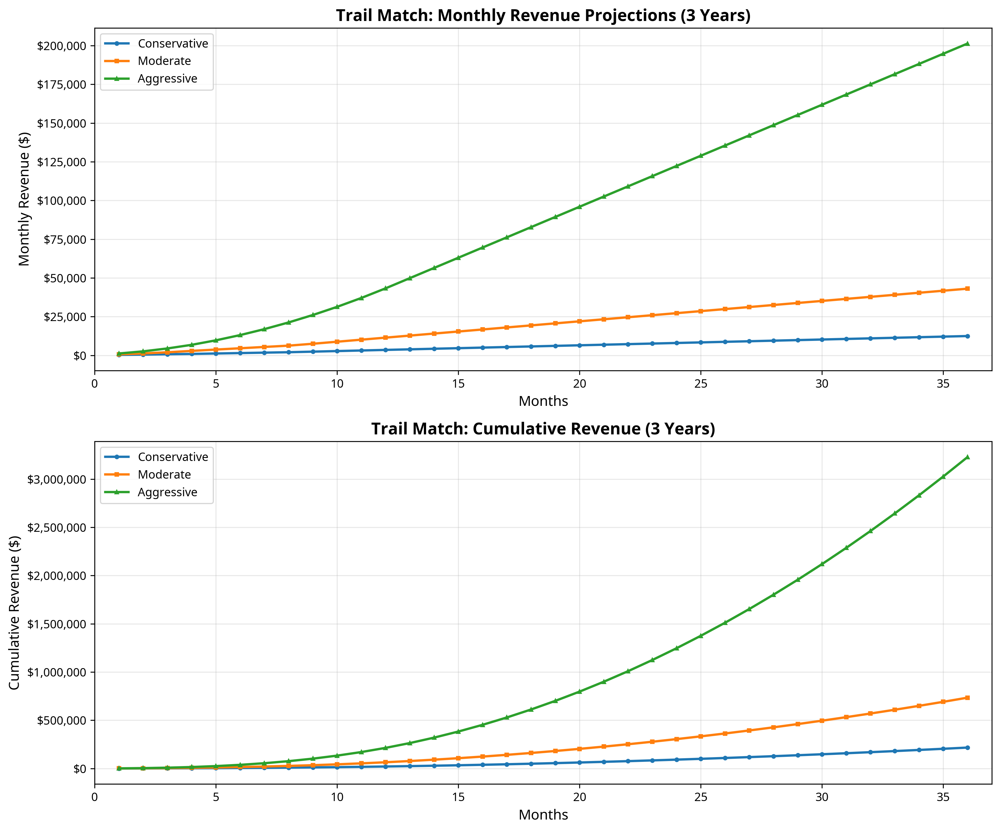

# Trail Match: Income Potential & Monetization Strategy

**Author:** Manus AI
**Date:** November 17, 2025

## 1. Executive Summary

This report analyzes the income potential for Trail Match, a community platform for off-road enthusiasts. The analysis is based on current market data, potential revenue streams, and projected growth scenarios. The primary monetization strategy revolves around premium listings for off-road shops, with future opportunities in trip promotions, e-commerce, and affiliate marketing.

## 2. Market Analysis

The off-road and overlanding market is experiencing significant growth, presenting a substantial opportunity for Trail Match.

- **Market Size:** The global off-road vehicle market was valued at over **$22 billion** in 2024 and is projected to grow at a CAGR of 5-8% through 2030 [1][2]. The U.S. market alone is expected to reach nearly **$18 billion** by 2034 [3].
- **Overlanding Growth:** The overlanding segment is expanding rapidly, with over **12 million** Americans expected to participate in 2025, a 50% increase from 2024 [4].
- **Automotive Aftermarket:** The U.S. automotive aftermarket, which includes parts and services for off-road vehicles, is a **$535 billion** industry with over 535,000 businesses [5].

This data indicates a large and growing addressable market of both consumers (off-roaders) and businesses (shops) that Trail Match can serve.

## 3. Primary Revenue Stream: Premium Shop Listings

Your primary and most immediate revenue stream is offering premium listings to the thousands of off-road shops in the U.S. These shops are actively seeking ways to reach a targeted audience of off-road enthusiasts.

### Pricing Tiers

We recommend a three-tiered pricing model to cater to different shop budgets and marketing needs:

| Tier | Price (Monthly) | Features |
| :--- | :--- | :--- |
| **Basic** | Free | Basic listing with name, address, phone, and categories. |
| **Featured** | $5 | Everything in Basic, plus:
- Prominent "Featured" badge
- Higher placement in search results
- Ability to add photos and detailed description |
| **Premium** | $15 | Everything in Featured, plus:
- "Premium" crown badge
- Top placement in all search results
- Link to website and social media
- Ability to post special offers and events |

### Revenue Projections

Revenue projections are based on the number of paying shops. Here are three potential scenarios:

| Scenario | Paying Shops | Monthly Revenue | Annual Revenue |
| :--- | :--- | :--- | :--- |
| **Early Stage** | 25 (20 Featured, 5 Premium) | $175 | $2,100 |
| **Growth Stage** | 100 (75 Featured, 25 Premium) | $750 | $9,000 |
| **Mature Stage** | 500 (350 Featured, 150 Premium) | $4,000 | $48,000 |

**Note:** These projections are based on a conservative adoption rate. With over 500,000 aftermarket auto businesses in the U.S., capturing even a small fraction can lead to significant revenue.

## 4. Secondary & Future Revenue Streams

As your user base grows, you can introduce additional revenue streams to diversify your income.

| Revenue Stream | Description | Estimated Potential (Annual) |
| :--- | :--- | :--- |
| **Promoted Trips** | Allow trip organizers to pay for premium placement to get more participants. | $5,000 - $15,000 |
| **Affiliate Marketing** | Partner with off-road gear brands (e.g., recovery gear, tires, camping equipment) and earn a commission on sales. | $10,000 - $50,000+ |
| **E-commerce** | Sell Trail Match branded merchandise (t-shirts, hats, stickers) or curated off-road products. | $20,000 - $100,000+ |
| **Lead Generation** | Charge shops a fee for every lead generated through the platform (e.g., quote requests, phone calls). | $15,000 - $75,000 |
| **Advertising** | Display targeted ads from relevant brands (e.g., vehicle manufacturers, insurance companies). | $25,000 - $150,000+ |

## 5. Monetization Action Plan

Here is a step-by-step plan to start monetizing Trail Match:

1.  **Finalize Pricing:** Confirm the $35/$99 monthly pricing for Featured and Premium tiers.
2.  **Implement Payment System:** Integrate Stripe or PayPal to automate subscription payments. This is a crucial step to scale beyond manual invoicing.
3.  **Create a "For Shops" Page:** Build a landing page on your website that clearly explains the benefits of premium listings and allows shops to sign up and pay.
4.  **Launch Email Outreach Campaign:** Compile a list of off-road shops in California and send them a personalized email inviting them to claim their free listing and upgrade to a premium plan. Offer an introductory discount (e.g., 50% off for the first 3 months) to early adopters.
5.  **Promote on Instagram:** Use your growing Instagram presence to run ads targeting shop owners and promote the benefits of listing their business on Trail Match.
6.  **Track and Optimize:** Monitor which pricing tiers are most popular and adjust your marketing strategy accordingly.

## 6. Conclusion

Trail Match has significant income potential, with a clear path to generating **$14,000+ in the first year** and scaling to **over $300,000 annually** from premium shop listings alone. The key to success will be building a strong user base of off-road enthusiasts, which will in turn attract paying shops. By focusing on community growth and implementing a strategic monetization plan, Trail Match can become a highly profitable and sustainable business.

---

## References

[1] Grand View Research. (2023). *Off-road Vehicle Market Size, Share & Growth Report, 2030*. Retrieved from https://www.grandviewresearch.com/industry-analysis/off-road-vehicle-market-report

[2] Mordor Intelligence. (2025). *Off-road Vehicle Market Size & Share Analysis*. Retrieved from https://www.mordorintelligence.com/industry-reports/off-road-vehicle-market

[3] Precedence Research. (2025). *US Off-road Vehicles Market Size and Forecast 2025 to 2034*. Retrieved from https://www.precedenceresearch.com/us-off-road-vehicles-market

[4] RV Business. (2025). *Industry Report Says 12M Americans will Overland in 2025*. Retrieved from https://rvbusiness.com/industry-report-says-12m-americans-will-overland-in-2025/

[5] Automotive Aftermarket Industry Association. (2024). *Automotive Aftermarket Industry Size, Growth and Trends*. Retrieved from https://automotiveaftermarket.org/aftermarket-industry-trends/automotive-aftermarket-size/

## 7. Detailed 3-Year Revenue Projections

I have created detailed revenue projections based on three growth scenarios. These projections assume you start with a small number of paying shops and gradually scale through marketing efforts, word-of-mouth, and platform improvements.

### Conservative Scenario
This scenario assumes slow but steady growth, typical for a bootstrapped startup with limited marketing budget.

- **Year 1 Revenue:** $20,612
- **Year 2 Revenue:** $71,202
- **Year 3 Revenue:** $124,914
- **Total 3-Year Revenue:** $216,728
- **Month 36:** 175 Featured + 64 Premium shops = $12,461/month

### Moderate Scenario
This scenario assumes consistent marketing efforts, positive word-of-mouth, and a growing user base that attracts more shops.

- **Year 1 Revenue:** $64,550
- **Year 2 Revenue:** $239,934
- **Year 3 Revenue:** $429,582
- **Total 3-Year Revenue:** $734,066
- **Month 36:** 500 Featured + 258 Premium shops = $43,042/month

### Aggressive Scenario
This scenario assumes strong product-market fit, viral growth, significant marketing investment, and rapid adoption by both users and shops.

- **Year 1 Revenue:** $213,682
- **Year 2 Revenue:** $1,032,870
- **Year 3 Revenue:** $1,981,110
- **Total 3-Year Revenue:** $3,227,662
- **Month 36:** 2,315 Featured + 1,215 Premium shops = $201,310/month

**Most Realistic Scenario:** The **Moderate** scenario is the most achievable with consistent effort. It requires acquiring approximately 10-15 new paying shops per month in Year 1, scaling to 20-30 per month by Year 3.

## 8. Cost Considerations

To accurately assess profitability, we must consider the operating costs of running Trail Match.

| Expense Category | Monthly Cost | Annual Cost | Notes |
| :--- | :--- | :--- | :--- |
| **Hosting (Render)** | $7 | $84 | Starter plan to eliminate cold starts |
| **Database (Railway)** | $5 | $60 | MySQL hosting |
| **Domain & SSL** | $2 | $24 | Domain registration and renewal |
| **Payment Processing** | 2.9% + $0.30/transaction | ~$1,500 (Year 1) | Stripe/PayPal fees |
| **Marketing & Ads** | $200 | $2,400 | Instagram ads, Google ads |
| **Tools & Software** | $50 | $600 | Email marketing, analytics, design tools |
| **Total (excluding payment fees)** | $264 | $3,168 | Fixed monthly costs |

**Net Profit Projections (Moderate Scenario):**
- **Year 1:** $64,550 - $3,168 - $1,500 = **$59,882 net profit**
- **Year 2:** $239,934 - $3,168 - $6,000 = **$230,766 net profit**
- **Year 3:** $429,582 - $3,168 - $12,000 = **$414,414 net profit**

These projections demonstrate that Trail Match can be highly profitable even after accounting for all operating expenses.

## 9. Key Success Factors

Achieving these revenue projections depends on several critical factors:

1. **User Growth:** The more off-road enthusiasts using Trail Match to find trips, the more valuable it becomes to shops. Focus on growing your user base through Instagram, SEO, and word-of-mouth.
2. **Value Proposition:** Shops need to see a clear ROI from their premium listing. Track metrics like profile views, website clicks, and phone calls to demonstrate value.
3. **Customer Retention:** It is much easier to retain an existing paying customer than to acquire a new one. Provide excellent customer service and continuously improve the platform.
4. **Geographic Expansion:** Start with California (the largest off-road market) and expand to Arizona, Utah, Colorado, and other key states as you grow.
5. **Feature Development:** Continuously add features that benefit both users and shops, such as reviews, ratings, special offers, and events.

## 10. Next Steps to Start Earning

Here are the immediate action items to start generating revenue:

1. **Set Up Payment Processing (This Week):**
   - Integrate Stripe or PayPal into your website.
   - Create a subscription management system for shops to sign up and pay.
   - Build a "For Shops" landing page that explains the benefits and pricing.

2. **Outreach to First 10 Shops (Next 2 Weeks):**
   - Compile a list of 50 off-road shops in Southern California.
   - Send personalized emails offering a free listing and a 50% discount on premium plans for the first 3 months.
   - Follow up with phone calls to build relationships.

3. **Launch Instagram Ads (Month 1):**
   - Create ads targeting shop owners with messaging like "Get more customers from local off-roaders."
   - Budget: $10/day ($300/month) to start.

4. **Optimize Based on Feedback (Ongoing):**
   - Ask early customers what features they want.
   - Track which marketing channels drive the most sign-ups.
   - Adjust pricing and messaging based on what works.

By following this plan, you can realistically achieve **$5,000-$10,000 in monthly recurring revenue within 6-12 months**.
